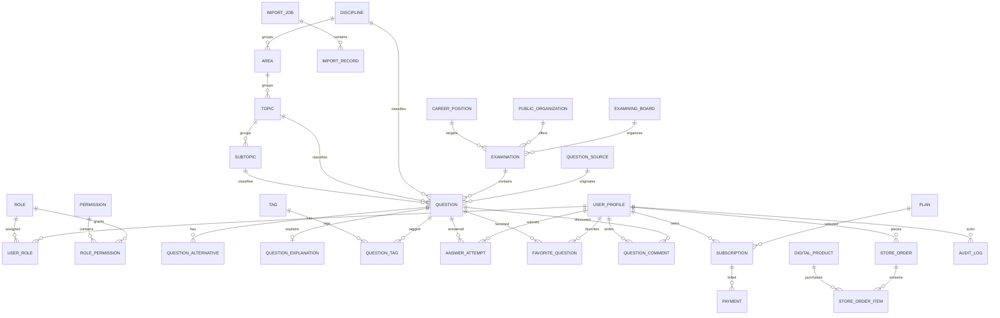

# SOUBIZURADO — TECHNICAL SPECIFICATION v1.0 — PART 2

This document continues `docs/technical-specification.md` from **Section 3.7** onward.

The two files together constitute **Technical Specification v1.0**.

---

# 3. Non-Functional Requirements — Continuation

## 3.7 Availability, Recovery and Operational Resilience

### NFR-049 — Graceful Failure

The application shall fail in a controlled manner when an external dependency is unavailable.

Failure of a non-critical integration shall not corrupt authoritative business state.

### NFR-050 — Recoverable Background Work

Background operations that affect important business state shall be recoverable after interruption whenever practical.

### NFR-051 — Database Backup Capability

The production PostgreSQL provider shall support backups appropriate to the operational importance of the stored data.

Backup availability shall be verified before production launch.

### NFR-052 — Restore Procedure

A documented procedure shall exist for restoring application data from an available database backup.

A backup shall not be considered operationally sufficient merely because it exists; restoration must be understood and periodically verifiable.

### NFR-053 — Object Storage Recovery Awareness

Important object-storage content shall use lifecycle and recovery practices appropriate to its business importance.

### NFR-054 — Deployment Rollback Capability

Production deployment procedures shall preserve a practical rollback or recovery path when a release causes a critical failure.

### NFR-055 — Migration Safety

Database migrations shall be designed to minimize destructive or irreversible production changes.

High-risk migrations shall use staged or otherwise controlled migration strategies where necessary.

### NFR-056 — Health Verification

Production deployments shall support a simple application health verification mechanism sufficient to determine whether the deployed application is responding correctly.

### NFR-057 — No Single-Process Durability Assumption

The system shall not rely on a specific Node.js process remaining alive to preserve authoritative business data or durable job state.

---

## 3.8 Deployment and Infrastructure Portability

### NFR-058 — Hostinger Compatibility

The initial production application shall be deployable on **Hostinger Business Web Hosting** using the hosting capabilities exposed through the provider's supported Node.js and deployment interfaces.

### NFR-059 — No SSH Dependency

Production operation shall not require SSH access.

Deployment, configuration and routine application operation shall be achievable through supported hosting-panel, Git-based, file-based or HTTP-accessible mechanisms.

### NFR-060 — No Docker Production Dependency

The initial production architecture shall not require Docker on Hostinger.

Local tooling may use optional containers in the future only if doing so does not make production depend on them.

### NFR-061 — Provider-Independent Domain Logic

Business rules shall not import or directly depend on Hostinger-specific APIs or concepts.

### NFR-062 — Database Provider Portability

Application-domain behavior shall depend on PostgreSQL semantics required by the product rather than on proprietary Supabase-only business logic where avoidable.

### NFR-063 — Object Storage Portability

Application modules shall access object storage through an application-owned abstraction so that Cloudflare R2 may be replaced without rewriting domain rules.

### NFR-064 — Cache Provider Portability

Cache, rate-limiting and temporary coordination capabilities shall be accessed through application-owned interfaces where provider coupling would otherwise leak into business logic.

### NFR-065 — Payment Provider Portability

Billing-domain logic shall depend on an application payment-gateway contract rather than directly on Stripe or Mercado Pago SDK semantics.

### NFR-066 — Future Hosting Portability

The architecture shall remain migratable to a VPS or major cloud platform without redesigning the core domain model.

---

## 3.9 Storage, Cache and Temporary State

### NFR-067 — Object Storage for Binary Assets

Question media, alternative media, explanation media, PDFs, import source files, product files and other large binary assets shall be stored in object storage rather than directly in PostgreSQL unless a specific exception is justified.

### NFR-068 — Database Metadata for Stored Objects

PostgreSQL shall store the metadata, object key, ownership/association and relevant lifecycle state required to manage stored assets.

### NFR-069 — Cloudflare R2 Initial Provider

The initial object-storage provider shall be **Cloudflare R2**.

R2 shall be treated as infrastructure rather than as a domain owner.

### NFR-070 — Redis Non-Authority

Redis shall not be the authoritative source of persistent business data.

Loss of Redis data shall not corrupt canonical study, question, billing or store records.

### NFR-071 — Upstash Redis Initial Provider

The initial Redis-compatible provider shall be **Upstash Redis** when Redis-backed capabilities become necessary.

### NFR-072 — Redis Use Cases

Approved Redis use cases may include:

- caching;
- rate limiting;
- temporary counters;
- short-lived coordination;
- distributed locks where justified;
- temporary sessions where required by an integration;
- short-lived queue or dispatch metadata where loss is acceptable or recoverable from PostgreSQL.

### NFR-073 — Explicit Cache Expiration

Cached data shall have explicit invalidation or expiration behavior appropriate to the use case.

### NFR-074 — Cache Bypass Correctness

The application shall remain functionally correct when a cache miss occurs.

---

## 3.10 Observability

### NFR-075 — Error Monitoring

Production application exceptions shall be observable through an error-monitoring service.

The initial error-monitoring provider shall be **Sentry**.

### NFR-076 — Operational Monitoring

Production availability and operational checks shall be observable through an external monitoring service.

The initial operational monitoring provider shall be **Better Stack**.

### NFR-077 — Structured Application Logging

Important server-side operational logs shall use a consistent structure sufficient to identify time, severity, component and relevant request or operation context.

### NFR-078 — Correlation Context

Where practical, related request, job and integration activity shall carry correlation identifiers or equivalent context to support troubleshooting.

### NFR-079 — Sensitive Data Redaction

Logging, error monitoring and observability integrations shall redact or omit secrets and unnecessarily sensitive data.

### NFR-080 — Business-Critical Failure Alerting

Failures involving payments, imports, persistent jobs or production availability shall support actionable alerting when those capabilities are introduced.

### NFR-081 — Observability Without Domain Coupling

Domain logic shall not depend directly on Sentry, Better Stack or another observability vendor.

---

## 3.11 CI/CD and Engineering Quality

### NFR-082 — Automated Pull Request Validation

Pull requests that modify application code shall be capable of running automated validation through GitHub Actions.

### NFR-083 — Type Checking

TypeScript type checking shall pass before an application change is considered releasable.

### NFR-084 — Lint Validation

Lint validation shall pass before an application change is considered releasable.

### NFR-085 — Build Validation

The production application build shall pass before an application change is considered releasable.

### NFR-086 — Automated Tests

Applicable automated tests shall pass before affected behavior is considered releasable.

### NFR-087 — Migration Validation

Database migrations shall be reviewed and validated before production application.

### NFR-088 — Controlled Deployment

Production deployment shall occur from an identified source revision rather than from untracked local files.

### NFR-089 — Secret Isolation in CI

CI/CD secrets shall use protected GitHub or provider secret-storage mechanisms and shall not be stored in repository files.

### NFR-090 — Deployment Independence from Developer Machine

A production release shall not require unpublished files or configuration that exist only on the developer's local computer.

---

## 3.12 Maintainability and Code Quality

### NFR-091 — TypeScript Strict Mode

Application TypeScript shall keep `strict` mode enabled.

### NFR-092 — Avoid Uncontrolled `any`

The application shall avoid `any` unless a narrowly scoped and documented integration constraint makes it necessary.

### NFR-093 — Explicit Module Boundaries

Domain modules shall expose explicit public interfaces and shall avoid uncontrolled access to another module's internal implementation.

### NFR-094 — Dependency Direction

Domain and application logic shall not depend directly on presentation frameworks or infrastructure providers.

### NFR-095 — Replaceable Infrastructure Adapters

Infrastructure integrations with PostgreSQL ORM, object storage, Redis, payment providers and monitoring tools shall be isolated behind application-owned boundaries where that isolation produces meaningful portability or testability.

### NFR-096 — Incremental Architecture

The codebase shall introduce architectural abstractions only when a current or clearly imminent use case requires them.

### NFR-097 — Documentation of Material Decisions

Material architectural decisions that change established structure, technology or system behavior shall be documented in `/docs`, using ADRs when appropriate.

### NFR-098 — Migration-Driven Schema Evolution

Structural database changes shall be performed through version-controlled migrations.

---

## 3.13 Accessibility, Web Compatibility and SEO Quality

### NFR-099 — Semantic HTML

Public and student-facing interfaces shall use semantic HTML appropriate to the content and interaction.

### NFR-100 — Keyboard Accessibility

Core study and navigation interactions shall remain usable through keyboard input where applicable.

### NFR-101 — Accessible Form Controls

Interactive controls shall provide labels, names and states that are accessible to assistive technologies.

### NFR-102 — Responsive Interface

Core user flows shall remain usable on common mobile and desktop viewport sizes.

### NFR-103 — Modern Browser Support

The application shall target currently maintained major browsers compatible with the selected Next.js runtime and generated web standards.

### NFR-104 — Technical SEO Foundations

Public indexable pages shall support appropriate metadata, canonicalization, crawl control and sitemap integration according to their content type.

### NFR-105 — Performance-Aware Public Pages

Public SEO-oriented pages shall avoid unnecessary client-side JavaScript and shall prefer server rendering or static generation where appropriate.

### NFR-106 — Index Quality over Page Volume

Programmatic SEO shall not generate large numbers of low-value or effectively duplicate pages merely to increase indexable URL count.

---

## 3.14 Non-Functional Requirement Completion Rule

The baseline non-functional requirements for Technical Specification v1.0 are **NFR-001 through NFR-106**.

Future requirements shall continue from `NFR-107` rather than renumbering existing identifiers.

Implementation of an NFR shall be considered complete only when the relevant architecture, code, configuration, operational procedure or automated verification materially satisfies it.

---

# 4. Target System Architecture

## 4.1 Architectural Style

Sou Bizurado shall begin as a **Modular Monolith**.

The deployable web application is one Next.js application, but the internal codebase is divided into explicit business modules.

This approach is selected because it provides:

- low operational complexity for one developer;
- straightforward Hostinger deployment;
- transactional consistency through one PostgreSQL database;
- clear business boundaries;
- a path to later extraction of a module only if real scale or organizational needs justify it.

Microservices are not part of the initial architecture.

## 4.2 Primary Runtime

The application runtime consists of:

1. **Next.js application** on Hostinger;
2. **Supabase PostgreSQL** as the primary relational database;
3. **Supabase Auth** as the initial authentication provider;
4. **Cloudflare R2** for binary/object storage;
5. **Upstash Redis** when cache, rate-limit or temporary coordination becomes necessary;
6. **Sentry** for error monitoring;
7. **Better Stack** for external operational monitoring;
8. **Stripe and/or Mercado Pago adapters** when payments are implemented;
9. GitHub and GitHub Actions for source control and CI/CD validation.

## 4.3 Application Layers

A module may contain the following layers when needed:

### Domain

Contains business concepts, invariants, value objects, domain services and domain events that do not depend on Next.js, Prisma, Supabase or other infrastructure providers.

### Application

Contains use cases, commands/queries where useful, application services, authorization orchestration and ports required by the use case.

### Infrastructure

Contains Prisma repositories, provider adapters, external service clients, object-storage implementations, Redis implementations and payment-provider adapters.

### Presentation

Contains route handlers, server actions where justified, Server Components, Client Components and view-model mapping.

Not every module must contain all four folders on day one.

## 4.4 Dependency Direction

The intended dependency direction is:

`presentation -> application -> domain`

and

`infrastructure -> application/domain contracts`

Domain code must not import Next.js, Prisma, Supabase SDKs, Stripe SDKs, R2 clients or Redis clients.

## 4.5 Server Components and Client Components

Next.js Server Components shall be the default for application and public pages.

Client Components shall be introduced only where browser state, event handlers, interactive controls or browser APIs require them.

## 4.6 Route Handlers

Route Handlers shall be used for HTTP endpoints such as:

- provider webhooks;
- integration callbacks;
- externally invoked job-processing endpoints;
- public API endpoints when required.

## 4.7 Server Actions

Server Actions may be used for application-owned form mutations where they improve clarity and do not conflict with integration or API requirements.

They shall still invoke application use cases and backend authorization.

## 4.8 Repository Pattern

Repository interfaces shall be introduced at module/application boundaries where they provide meaningful isolation from persistence.

Repositories shall not become generic CRUD abstractions detached from domain use cases.

## 4.9 Unit of Work and Transactions

Prisma transactions or an application-level transaction boundary may be used where a use case requires atomic persistent changes.

A generic Unit of Work abstraction shall only be introduced if repeated transaction orchestration justifies it.

## 4.10 CQRS

The application may distinguish read models from write use cases where query complexity justifies it.

A full CQRS architecture is not required for the MVP.

## 4.11 Internal Events

Modules may publish internal application/domain events for secondary reactions that should not be embedded directly in the originating use case.

Examples may include:

- answer recorded;
- question published;
- subscription activated;
- digital purchase confirmed;
- import completed.

The initial event mechanism remains in-process unless durability requirements justify persistence.

## 4.12 Outbox Pattern

A transactional outbox shall be introduced only for events whose reliable asynchronous delivery is required across process boundaries or external integrations.

The presence of future asynchronous workflows is not sufficient reason to implement an outbox immediately.

## 4.13 Background Processing

The architecture shall not require a permanently running worker process on Hostinger.

Long-running operations shall use persistent PostgreSQL job state and a replaceable `JobDispatcher`/job-runner boundary.

Execution may initially occur through controlled HTTP invocations, hosting-supported schedules or an external dispatch service.

A future dedicated worker may be introduced after migration to infrastructure that supports it, without changing job ownership or canonical job state.

---

# 5. Bounded Contexts and Modules

## 5.1 Identity & Access

Owns:

- application profiles;
- roles;
- permissions;
- account application state;
- authorization policies.

Authentication credentials remain owned by Supabase Auth.

## 5.2 Taxonomy

Owns:

- Discipline;
- Area;
- Topic;
- Subtopic;
- Tag.

Taxonomy is an explicit module because many other modules reference classification data while no other module should silently own it.

## 5.3 Exams

Owns:

- ExaminingBoard;
- PublicOrganization;
- CareerPosition;
- Examination.

## 5.4 Question Bank

Owns:

- Question;
- QuestionAlternative;
- QuestionExplanation;
- QuestionSource;
- question publication/version state;
- relationships between questions and classification metadata.

## 5.5 Study

Owns:

- AnswerAttempt;
- FavoriteQuestion;
- ReviewItem;
- StudySession when implemented.

Study consumes published question information but does not own question content.

## 5.6 Analytics

Owns derived performance calculations and, where justified later, persisted aggregates/read models.

Authoritative raw answer history remains owned by Study.

## 5.7 Comments

Owns:

- QuestionComment;
- CommentReport;
- moderation state.

## 5.8 Media

Owns:

- MediaAsset metadata;
- object-storage lifecycle metadata;
- upload/availability state.

Binary bytes are stored in R2.

## 5.9 Imports

Owns:

- ImportJob;
- ImportBatch/Chunk when required;
- ImportRecord/StagingRecord;
- validation/review state;
- duplicate-detection results.

Published questions ultimately become Question Bank records.

## 5.10 Billing

Owns:

- Plan;
- Feature;
- Entitlement;
- UsageLimit;
- Subscription;
- Payment;
- provider-event idempotency records.

## 5.11 Store

Owns:

- DigitalProduct;
- StoreOrder;
- StoreOrderItem where required;
- purchased-download entitlement.

## 5.12 Blog

Owns:

- BlogPost;
- editorial publication state;
- editorial metadata.

## 5.13 Administration

Administration is an orchestration/interface module.

It does **not** become the owner of users, questions, exams, products, payments or blog posts.

Administrative screens invoke use cases from the module that owns the affected business data.

---

# 6. Core Domain Model

## 6.1 Identity & Access Entities

### UserProfile

Represents the Sou Bizurado application profile associated with an authenticated identity.

Key concepts:

- id;
- auth provider subject/user id;
- display information;
- account status;
- timestamps.

### Role

Represents a named application role.

### Permission

Represents an explicit backend capability that may be granted to roles.

### UserRole

Associates users and roles.

### RolePermission

Associates roles and permissions.

## 6.2 Taxonomy Entities

### Discipline

Top-level academic discipline.

### Area

Optional intermediate academic grouping.

### Topic

Topic within a taxonomy hierarchy.

### Subtopic

More specific content classification beneath a topic.

### Tag

Reusable cross-cutting content label.

## 6.3 Exams Entities

### ExaminingBoard

Organization responsible for preparing or administering examination questions.

### PublicOrganization

Government organization or institution associated with an examination.

### CareerPosition

Career, office, position or equivalent target of an examination.

### Examination

Represents an examination/event and references its board, organization, target and year where applicable.

## 6.4 Question Bank Entities

### Question

Core question record.

Key concepts include:

- type: `MULTIPLE_CHOICE` or `TRUE_FALSE`;
- statement/content;
- publication state;
- answer-key state;
- source;
- classification;
- timestamps.

### QuestionAlternative

Ordered alternative belonging to a multiple-choice question.

### QuestionExplanation

Explanation/resolution associated with a question.

### QuestionSource

Structured provenance record containing the information required to identify origin and licensing/publication status.

### QuestionTag

Many-to-many association between questions and tags when tags are implemented.

## 6.5 Study Entities

### AnswerAttempt

Persistent record of one student's answer attempt.

Minimum conceptual fields:

- id;
- user_id;
- question_id;
- selected answer/alternative;
- correctness result;
- response duration when available;
- attempt number or equivalent sequence;
- answered_at.

### FavoriteQuestion

User-to-question association identifying a favorite.

### ReviewItem

Optional future record indicating that a question should be revisited.

### StudySession

Optional future grouping of related question-solving activity.

## 6.6 Import Entities

### ImportJob

Persistent import operation and its lifecycle status.

### ImportRecord

Staging representation of an imported question before publication.

### ImportIssue

Validation, classification, duplicate or review issue associated with imported data.

## 6.7 Billing Entities

### Plan

Commercial plan definition. Initial plans are FREE and PREMIUM.

### Feature

Named product capability that may be entitled or limited.

### PlanFeature / Entitlement Rule

Associates plan access with features or limits.

### Subscription

Application-level subscription record independent from a provider-specific subscription object.

### Payment

Application-level payment transaction record.

### PaymentProviderEvent

Stores external provider event identifiers and processing state for idempotency.

## 6.8 Store Entities

### DigitalProduct

Sellable digital product metadata and authoritative application price.

### StoreOrder

Digital-store purchase order.

### StoreOrderItem

Order line item when the store supports one or more items per order.

### DigitalAccessGrant

Represents authorization to access a purchased digital asset where a separate grant provides clearer lifecycle control.

## 6.9 Blog Entities

### BlogPost

Editorial post with publication state, slug, metadata and content.

## 6.10 Cross-Cutting Entities

### MediaAsset

Metadata for an object stored in R2.

### AuditLog

Security-sensitive or administratively significant application event.

### OutboxEvent

Optional durable event record, introduced only when transactional asynchronous delivery is required.

---

# 7. Logical Data Relationships and ERD

## 7.1 Relationship Principles

- Core relational identifiers shall use stable surrogate identifiers.
- Foreign-key relationships shall preserve referential integrity where practical.
- Historical answer records shall reference the question identity used at answer time.
- Question edits that would invalidate historical meaning shall use controlled revision/version behavior when required.
- Many-to-many relationships shall use explicit association tables where appropriate.

## 7.2 Logical ERD



This ERD is logical rather than a final Prisma schema. Physical names, optionality, indexes and join-table details shall be finalized during the database-design stage.

---

# 8. Authentication and Authorization Architecture

## 8.1 Authentication Provider Decision

The initial authentication provider shall be **Supabase Auth**.

Supabase Auth is responsible for authentication identity and credential/session mechanisms.

Sou Bizurado remains responsible for application authorization.

## 8.2 Identity Mapping

Each authenticated Supabase identity shall map to a `UserProfile` in the Sou Bizurado PostgreSQL domain model.

The application profile shall contain the application account state and authorization relationships.

## 8.3 Authorization

Authorization shall use application-controlled roles and permissions evaluated on the server.

UI visibility may improve user experience but is not a security boundary.

## 8.4 Initial Roles

Initial role candidates:

- STUDENT;
- MODERATOR;
- EDITOR;
- CONTENT_MANAGER;
- ADMINISTRATOR;
- SUPER_ADMINISTRATOR.

The physical role model may use role records rather than a hard-coded enum if that improves maintainability.

## 8.5 Permission Model

Permissions should represent backend capabilities such as:

- `questions.create`;
- `questions.edit`;
- `questions.publish`;
- `taxonomy.manage`;
- `exams.manage`;
- `imports.manage`;
- `comments.moderate`;
- `billing.view`;
- `store.manage`;
- `blog.manage`.

Final permission names are established during Identity & Access implementation.

## 8.6 Protected Request Flow

1. request arrives at server-controlled code;
2. authenticated identity is resolved;
3. application profile/account state is loaded as required;
4. required permission or ownership rule is evaluated;
5. input is validated;
6. application use case executes;
7. persistence/integration occurs;
8. auditable operations emit an audit record when required.

---

# 9. Question Solving Flow

## 9.1 Question Retrieval

1. student provides supported filters;
2. server validates filter input;
3. query resolves only eligible/published questions;
4. entitlement restrictions are applied when relevant;
5. results use bounded pagination;
6. answer-key information that must remain hidden before answering is not exposed to the client.

## 9.2 Answer Submission

1. authenticated student submits an answer to a question id;
2. backend validates question eligibility and submitted answer format;
3. backend loads authoritative answer-key information;
4. correctness is calculated on trusted server code;
5. an immutable `AnswerAttempt`-style history record is persisted;
6. response time is stored when supplied through a trusted/validated flow;
7. response returns correctness and permitted explanation information.

## 9.3 Answer-History Principle

Repeated attempts shall create history rather than overwrite the previous answer record.

Derived concepts such as "last answer" or "currently incorrect" are calculated from or explicitly projected from answer history.

## 9.4 Favorites

Favorite association shall be unique per user/question pair.

Adding an already-favorited question shall not create duplicate favorite records.

---

# 10. Question Import Architecture

## 10.1 Supported Format Roadmap

Initial:

- CSV;
- XLSX.

Next:

- JSON.

Later:

- DOCX;
- PDF.

## 10.2 Import Pipeline

The conceptual pipeline is:

`Upload -> R2 -> ImportJob -> Parser -> Normalizer -> Classifier -> Validator -> Deduplicator -> Review Queue -> Publish`

## 10.3 Upload

The original uploaded file is stored in R2 and represented by persistent import/media metadata.

## 10.4 Persistent Import Job

`ImportJob` records the lifecycle of the operation and survives application restarts.

Candidate states include:

- UPLOADED;
- QUEUED;
- PROCESSING;
- NEEDS_REVIEW;
- COMPLETED;
- PARTIALLY_COMPLETED;
- FAILED;
- CANCELLED.

Final enum values are fixed during physical data modeling.

## 10.5 Parser

Format-specific parsers convert source files into a common internal import representation.

## 10.6 Normalizer

Normalization standardizes applicable text, whitespace, alternative labels and comparable fields without silently changing the semantic meaning of a question.

## 10.7 Classifier

Classification associates imported content with known taxonomy/examination metadata or flags unresolved classification for review.

## 10.8 Validator

Validation ensures required content, answer keys, alternatives, types and provenance meet publication requirements.

## 10.9 Deduplication

Initial deterministic deduplication shall use normalized content and **SHA-256** or equivalent stable hashing strategy.

Semantic/AI deduplication is not part of the initial import system.

## 10.10 Review Queue

Records that cannot be safely auto-published remain in persistent review state.

## 10.11 Publication

Publication converts approved staging data into Question Bank records through Question Bank application use cases.

Imports do not bypass Question Bank validation merely because data arrived in bulk.

---

# 11. Plans, Subscriptions and Payment Flow

## 11.1 Commercial Baseline

Initial plans:

- FREE;
- PREMIUM.

Initial Premium price:

**R$ 9,99/month**.

This value shall not be silently changed by implementation decisions.

## 11.2 Central Entitlement Model

Feature access shall be evaluated through centralized concepts such as:

- Plan;
- Feature;
- Entitlement;
- UsageLimit.

Scattered checks such as `if plan === premium` throughout unrelated components are not an acceptable long-term authorization model.

## 11.3 Payment Gateway Contract

Billing shall define an application-owned `PaymentGateway` contract.

Provider adapters may include:

- Stripe;
- Mercado Pago.

## 11.4 Checkout / Subscription Initiation

1. authenticated user requests a supported purchase/subscription;
2. backend resolves authoritative plan/product and price;
3. backend creates provider operation through adapter;
4. client is redirected or receives provider-approved checkout information;
5. client completion is not authoritative for entitlement activation.

## 11.5 Webhook Flow

1. provider sends webhook;
2. application verifies signature/authenticity;
3. provider event id is checked for idempotency;
4. application maps provider event into billing-domain behavior;
5. payment/subscription state is updated transactionally where required;
6. entitlement state is recalculated/updated;
7. event processing result is recorded.

## 11.6 Cancellation and Expiration

Subscription cancellation and access expiration are separate concepts.

A cancelled subscription may remain entitled until the applicable paid period ends, according to provider and product rules.

---

# 12. Digital Store Flow

## 12.1 Product Authority

Product title, publication state, authoritative price and downloadable-asset association belong to the Store domain.

The payment provider does not become the application product catalog.

## 12.2 Purchase Flow

1. user selects a published digital product;
2. server resolves authoritative price;
3. store order is created in an appropriate pending state;
4. payment is initiated through Billing;
5. trusted payment confirmation updates order state;
6. digital access is granted;
7. protected download becomes available to the entitled user.

## 12.3 Download Security

Protected files shall not rely on a permanently public R2 URL as the authorization mechanism.

Access shall be verified before an authorized delivery mechanism or time-limited URL is issued.

---

# 13. Blog and Programmatic SEO Architecture

## 13.1 Blog

Blog publishing is an editorial capability independent from the Question Bank.

Posts shall support publication state, slug, metadata and associated media.

## 13.2 Public SEO Pages

The architecture shall support public pages for eligible:

- examinations;
- careers/positions;
- examining boards;
- curated/filter-based question collections;
- simulations where later appropriate.

## 13.3 Next.js Rendering Strategy

Public pages shall prefer Server Components and use static generation, revalidation or server rendering according to content freshness requirements.

## 13.4 SEO Controls

The application shall support:

- metadata;
- canonical URLs;
- sitemap generation;
- `robots` controls;
- noindex for low-value/private/ineligible pages;
- stable human-readable slugs where appropriate.

---

# 14. Security and LGPD Architecture

## 14.1 Validation

Backend input validation shall use **Zod** or another explicitly approved runtime-schema mechanism.

Zod shall be introduced as an application dependency when the first validated backend inputs are implemented, not merely for documentation completeness.

## 14.2 Upload Security

Uploads shall validate applicable:

- authorization;
- file size;
- expected extension;
- detected/declared content type where practical;
- destination/use case.

Uploaded files shall not be executed by the application.

## 14.3 Administrative Audit

Audit logging shall prioritize:

- role/permission changes;
- question publication changes;
- sensitive content changes;
- import operations;
- billing administrative actions;
- store access-grant changes;
- other security-sensitive administrative activity.

## 14.4 Personal Data

The application shall document which entities contain personal data before production launch.

## 14.5 Account Removal

Account-removal implementation shall distinguish between:

- authentication identity deletion;
- profile personal-data handling;
- records that may be anonymized;
- records that require legitimate retention.

Historical study or financial data shall not be destructively removed without considering integrity and legal requirements.

---

# 15. Infrastructure and Production Deployment

## 15.1 Production Topology

Initial production topology:

```text
Browser
   |
   | HTTPS
   v
Hostinger Business Web Hosting
   |
   +--> Next.js / Node.js application
   |
   +--> Supabase Auth
   |
   +--> Supabase PostgreSQL
   |
   +--> Cloudflare R2
   |
   +--> Upstash Redis (when needed)
   |
   +--> Stripe / Mercado Pago (later)
   |
   +--> Sentry
   |
   +--> Better Stack
```

## 15.2 Hostinger Constraints

Production design shall assume:

- Business Web Hosting;
- no SSH requirement;
- Node.js execution through supported hosting configuration;
- deployment through supported GitHub, ZIP, connector or panel mechanisms;
- finite CPU, memory and process limits;
- no permanently running custom worker requirement.

## 15.3 Database

Primary production database:

**Supabase PostgreSQL**.

Hostinger MariaDB is not the Sou Bizurado source of truth and shall not be introduced as a second canonical database.

## 15.4 ORM

The preferred ORM is **Prisma**.

Prisma shall be introduced during the database phase after the logical/physical model is reviewed.

Prisma is a persistence tool, not the domain model.

## 15.5 Connection Management

Database connection strategy shall account for Hostinger process limits and the connection behavior recommended by the selected Supabase/PostgreSQL access mode.

Connection pooling shall be configured when required by the production topology.

## 15.6 Object Storage

Cloudflare R2 stores binary assets.

The database stores metadata and object keys, not large binary payloads.

## 15.7 Redis

Upstash Redis is introduced only when a concrete cache, rate-limit or coordination requirement exists.

No MVP business feature shall depend on Redis being a source of truth.

## 15.8 Background Jobs

Persistent jobs live in PostgreSQL.

The job execution mechanism is replaceable and shall not require a resident Hostinger daemon.

## 15.9 Environment Variables

Local development uses an uncommitted environment file.

The repository shall contain `.env.example` with names and safe descriptions only when environment variables are first introduced.

Production secrets are configured through the hosting/service secret interfaces.

---

# 16. CI/CD and Test Strategy

## 16.1 Git Branch Model

Primary branches:

- `main` — production/release baseline;
- `develop` — integrated development;
- `feature/*` — isolated feature or technical work.

## 16.2 Pull Requests

Feature work is merged into `develop` through reviewable pull requests.

`main` receives deliberately approved releases rather than every development commit.

## 16.3 GitHub Actions Baseline

Application pull-request CI shall eventually execute:

1. dependency installation using the lockfile;
2. typecheck;
3. lint;
4. unit/integration tests applicable to the change;
5. production build.

## 16.4 Unit Tests

Unit tests target domain rules and isolated application behavior.

Examples:

- answer evaluation;
- entitlement calculation;
- subscription-state mapping;
- deterministic normalization/deduplication functions.

## 16.5 Integration Tests

Integration tests target boundaries involving persistence or multiple application components.

Examples:

- repository behavior;
- transactions;
- answer-history persistence;
- import-state transitions;
- webhook idempotency.

## 16.6 End-to-End Tests

E2E tests cover the highest-value user flows after those flows exist.

Initial candidates:

- sign in;
- filter questions;
- answer question;
- favorite question;
- view answer history.

## 16.7 Test Tool Decision Timing

Test frameworks shall be selected immediately before the first automated test implementation, based on current Next.js compatibility and project needs.

The specification does not install a testing dependency prematurely.

---

# 17. Technical Roadmap

## Phase 0 — Planning and Specification

Deliverables:

- Product Vision & Scope;
- functional requirements;
- non-functional requirements;
- target architecture;
- bounded contexts;
- logical domain model;
- major flows;
- infrastructure constraints;
- roadmap and acceptance gates.

**Gate:** Technical Specification v1.0 reviewed and accepted.

## Phase 1 — Windows Development Environment

Deliverables:

- Git;
- Node.js;
- npm;
- VS Code;
- GitHub repository and branch workflow.

**Current status:** completed.

## Phase 2 — Project Foundation

Deliverables:

- Next.js;
- React;
- TypeScript strict mode;
- App Router;
- `src/` layout;
- ESLint;
- typecheck/build validation;
- Git feature workflow.

**Current status:** completed on `develop` through PR #1.

## Phase 3 — Physical Modular Architecture

Deliverables:

- initial module folders;
- shared kernel boundaries kept minimal;
- configuration conventions;
- centralized error strategy;
- dependency-direction rules;
- first architecture documentation/ADR where required.

**Gate:** build, lint and typecheck pass; module boundaries are understandable without implementing unused layers.

## Phase 4 — PostgreSQL, Supabase and Prisma

Deliverables:

- Supabase project configuration;
- Prisma installation and configuration;
- reviewed physical ERD;
- first migration;
- migration workflow;
- seed strategy with fictitious data;
- environment schema/configuration.

**Gate:** fresh database can be created from migrations and validated locally/development environment.

## Phase 5 — Authentication and Authorization

Deliverables:

- Supabase Auth integration;
- UserProfile;
- protected application routes;
- application roles/permissions;
- server-side authorization baseline;
- account recovery flow.

**Gate:** student and administrative authorization tests prove protected behavior.

## Phase 6 — Question Bank

Deliverables:

- Taxonomy module MVP entities;
- Exams module MVP entities;
- Question/Alternative/Explanation/Source;
- administration use cases;
- publication workflow;
- CBMPE Oficial validation dataset entered through supported admin/development processes.

**Gate:** authorized operator can create/publish valid questions and unauthorized users cannot.

## Phase 7 — Student Experience

Deliverables:

- question filters;
- paginated question solving;
- answer evaluation;
- answer history;
- favorites;
- incorrect-question review.

**Gate:** complete MVP loop works: `find -> answer -> feedback -> review`.

## Phase 8 — Imports

Deliverables:

- R2 source-file storage;
- ImportJob;
- CSV/XLSX parser;
- normalization;
- deterministic SHA-256 deduplication;
- review queue;
- controlled publishing.

## Phase 9 — Statistics

Deliverables:

- base analytics queries;
- accuracy metrics;
- performance by relevant dimensions;
- performance evolution.

## Phase 10 — Simulations

Deliverables:

- simulation configuration;
- question selection;
- timer/state;
- submission;
- result/history.

## Phase 11 — Comments

Deliverables:

- comments;
- reporting;
- moderation.

## Phase 12 — Premium Entitlements

Deliverables:

- FREE/PREMIUM plans;
- Features;
- Entitlements;
- UsageLimits;
- backend enforcement.

## Phase 13 — Payments

Deliverables:

- PaymentGateway abstraction;
- first provider adapter;
- webhook verification;
- idempotency;
- subscription lifecycle.

## Phase 14 — Digital Store

Deliverables:

- digital products;
- orders;
- payment integration;
- controlled R2 downloads.

## Phase 15 — Blog

Deliverables:

- editorial CRUD;
- publication workflow;
- public post pages.

## Phase 16 — Enterprise SEO Foundations

Deliverables:

- examination/board/position public pages;
- metadata;
- canonical rules;
- sitemap;
- index-quality controls;
- programmatic-page performance review.

## Phase 17 — Intelligent Study

Deliverables:

- deterministic recommendations;
- weakness identification;
- recommendation traceability;
- AI features only where separately justified.

## Phase 18 — Production on Hostinger

Deliverables:

- Hostinger Node application configured;
- environment variables configured;
- production Supabase/R2 integrations;
- SSL/domain validation;
- Sentry;
- Better Stack;
- production migration procedure;
- health check;
- backup/restore procedure;
- deployment and rollback documentation.

**Gate:** production smoke test passes without SSH-dependent steps.

---

# 18. Target Folder Structure

The following structure is a target direction, not an instruction to create every directory immediately:

```text
src/
  app/
    (public)/
    (auth)/
    (student)/
    admin/
    api/

  modules/
    identity/
    taxonomy/
    exams/
    question-bank/
    study/
    analytics/
    comments/
    media/
    imports/
    billing/
    store/
    blog/

  shared/
    application/
    domain/
    infrastructure/
    presentation/

  config/

prisma/
  schema.prisma
  migrations/
  seed/

docs/
  architecture/
  database/
  security/
  deployment/
  development/
  decisions/
```

Rules:

- folders are created only when their first real responsibility exists;
- `shared` shall not become a dumping ground;
- business ownership remains inside modules;
- Prisma schema/migrations remain infrastructure, not the domain model;
- routes/pages may compose multiple modules but do not own their business rules.

---

# 19. Technical Specification v1.0 Acceptance Criteria

Technical Specification v1.0 is considered sufficient to begin implementation when the following are true:

1. product scope and MVP boundary are explicit;
2. functional requirements are identified and stable;
3. non-functional baseline is identified and stable;
4. modular-monolith architecture is explicit;
5. module ownership is explicit;
6. logical entities and major relationships are documented;
7. authentication and authorization ownership is defined;
8. question-solving flow is defined;
9. import flow is defined;
10. subscription/payment flow is defined;
11. store and blog boundaries are defined;
12. security and LGPD principles are defined;
13. production Hostinger/no-SSH constraint is explicit;
14. PostgreSQL/Supabase, R2, Redis and observability roles are explicit;
15. CI/CD and testing direction is explicit;
16. implementation roadmap and phase gates are explicit;
17. target folder structure is documented without requiring premature scaffolding.

Technical Specification v1.0 describes the architectural baseline.

It does not prevent future changes.

A material future change shall be documented, and existing requirement identifiers shall remain stable whenever practical.
